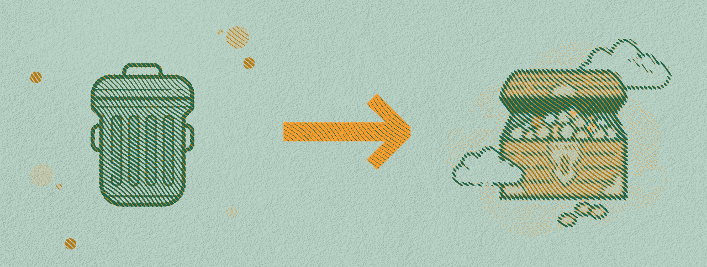

<div id="top"></div>
<!--
*** Thanks for checking out the Best-README-Template. If you have a suggestion
*** that would make this better, please fork the repo and create a pull request
*** or simply open an issue with the tag "enhancement".
*** Don't forget to give the project a star!
*** Thanks again! Now go create something AMAZING! :D
-->

<!-- PROJECT SHIELDS -->
<!--
*** I'm using markdown "reference style" links for readability.
*** Reference links are enclosed in brackets [ ] instead of parentheses ( ).
*** See the bottom of this document for the declaration of the reference variables
*** for contributors-url, forks-url, etc. This is an optional, concise syntax you may use.
*** https://www.markdownguide.org/basic-syntax/#reference-style-links
-->
[![Contributors][contributors-shield]][contributors-url]
[![Forks][forks-shield]][forks-url]
[![Stargazers][stars-shield]][stars-url]
[![Issues][issues-shield]][issues-url]
[![MIT License][license-shield]][license-url]
[![LinkedIn][linkedin-shield]][linkedin-url]

<!-- PROJECT LOGO -->
<br />
<div align="center">
  <a href="https://github.com/obverter/tmz-poetry">
    
  </a>

<h3 align="center">TMZ Poetry</h3>

  <p align="center">
    Turning trash into treasure one headline at a time.
    <br />
    <a href="headlines.csv"><strong>Explore the headlines »</strong></a>
    <br />
    <br />
    <a href="https://random.dog/">Enjoy a picture of a dog</a>
    ·
    <a href="https://github.com/obverter/tmz-poetry/issues">Report 🐛</a>
    ·
    <a href="https://github.com/obverter/tmz-poetry/issues">Request a Feature That I Probably Can't Build</a>
  </p>
</div>

<!-- TABLE OF CONTENTS -->
<details>
  <summary>Table of Contents</summary>
  <ol>
    <li>
      <a href="#about-the-project">About The Project</a>
      <ul>
        <li><a href="#built-with">Built With</a></li>
      </ul>
    </li>
    <li>
      <a href="#getting-started">Getting Started</a>
      <ul>
        <li><a href="#prerequisites">Prerequisites</a></li>
        <li><a href="#installation">Installation</a></li>
      </ul>
    </li>
    <li><a href="#usage">Usage</a></li>
    <li><a href="#roadmap">Roadmap</a></li>
    <li><a href="#contributing">Contributing</a></li>
    <li><a href="#license">License</a></li>
    <li><a href="#contact">Contact</a></li>
    <li><a href="#acknowledgments">Acknowledgments</a></li>
  </ol>
</details>

<!-- ABOUT THE PROJECT -->

## About The Project

<!--
[![Product Name Screen Shot][product-screenshot]](https://example.com) -->

<!-- Here's a blank template to get started: To avoid retyping too much info. Do a search and replace with your text editor for the following: `obverter`, `tmz-poetry`, `obverter`, `BenTylerElliott`, `obverter.com`, `ben`, `TMZ Poetry`, `Turning Trash Into Treasure` -->

Generally speaking, recycling is important. So is reusing. But reducing...?

When it comes to art, reducing is only desirable within a project's bounds.

</img>

> “The sculpture is already complete within the marble block, before I start my work. It is already there, I just have to chisel away the superfluous material.”
> <cite>Michelangelo di Lodovico Buonarroti Simoni</cite>

Once TMZ headlines have been out in the world for a day or three, they tend to fade from the zeitgeist. This is a shame.

And so I built this thing, which:

1. Automatically scrapes TMZ's main blogroll every five minutes. ✅
2. Appends new headlines to a monster, forever-updating csv. (`headlines.csv` descending by timestamp) ✅
3. Uses those headlines to train a handwritten grammar in spaCy. 🔨
4. Generates poetry from the headline corpus. 🔨
5. Overlays said poetry onto images scraped from Wikimedia Commons 🔨

You're welcome.

<p align="right">(<a href="#top">back to top</a>)</p>

### Built With

<!-- * [Next.js](https://nextjs.org/)
* [React.js](https://reactjs.org/)
* [Vue.js](https://vuejs.org/)
* [Angular](https://angular.io/)
* [Svelte](https://svelte.dev/)
* [Laravel](https://laravel.com)
* [Bootstrap](https://getbootstrap.com)
* [JQuery](https://jquery.com) -->

- [Python](https://python.org)
- [spaCy](https://spacy.io/)
- [GitHub Actions](https://github.com/features/actions)

<p align="right">(<a href="#top">back to top</a>)</p>

<!-- GETTING STARTED -->
<!-- ## Getting Started

This is an example of how you may give instructions on setting up your project locally.
To get a local copy up and running follow these simple example steps. -->

### Play around with my work

First, you'll need to clone the repo. Follow these instructions carefully.

1. Navigate to somewhere amazing on your machine.
   ```sh
   $ cd usr/banana/pajama/somewhere/amazing/
   ```
2. Clone the repo.
   ```sh
   $ git clone https://github.com/obverter/tmz-poetry.git
   ```
3. Ensure that your machine and this repo are codependent.
   ```sh
   $ pip install -r requirements.txt
   ```
4. Split the atom.
   ```sh
   $ jupyter notebook
   ```

<p align="right">(<a href="#top">back to top</a>)</p>

<!-- USAGE EXAMPLES -->

## Usage

Apply directly to the forehead.

<!-- Use this space to show useful examples of how a project can be used. Additional screenshots, code examples and demos work well in this space. You may also link to more resources. -->

<!-- _For more examples, please refer to the [Documentation](https://example.com)_ -->

<p align="right">(<a href="#top">back to top</a>)</p>

<!-- ROADMAP -->

## Roadmap

- [ ] Build NLP module.
- [ ] Build BKG module.
- [ ] Put it all together.
- [ ] Revisit this project in `np.random.default_rng().integers(low=1, high=12)` months.

See the [open issues](https://github.com/obverter/tmz-poetry/issues) for a full list of proposed features (and known issues).

<p align="right">(<a href="#top">back to top</a>)</p>

<!-- CONTRIBUTING -->

## Contributing

Contributions are what make the open source community such an amazing place to learn, inspire, and create. Any contributions you make are **greatly appreciated**.

If you have a suggestion that would make this better, please fork the repo and create a pull request. You can also simply open an issue with the tag "enhancement". Please don't be bashful. It is impossible to hurt my feelings, because I have none.

If my analyses or work seem fundamentally wrong and/or are yucking your yum, let me know why! Projects are never finished; only abandoned. I'm always looking to improve.

Don't forget to give the project a star! And then make a burner account and give it another star! Thanks again!

1. Fork the Project
2. Create your Feature Branch (`git checkout -b feature/AmazingFeature`)
3. Commit your Changes (`git commit -m 'Add some AmazingFeature'`)
4. Push to the Branch (`git push origin feature/AmazingFeature`)
5. Open a Pull Request

<p align="right">(<a href="#top">back to top</a>)</p>

<!-- LICENSE -->

## License

Distributed under the MIT License. See `LICENSE.txt` for more information.

<p align="right">(<a href="#top">back to top</a>)</p>

<!-- CONTACT -->

## Contact

[Email me](ben@obverter.com)

Project Link: [https://github.com/obverter/tmz-poetry](https://github.com/obverter/tmz-poetry)

<p align="right">(<a href="#top">back to top</a>)</p>

<!-- ACKNOWLEDGMENTS -->

## Acknowledgments

- [Lunchables](https://lunchables.com)
- [Allison Parrish](https://github.com/aparrish)
- [Jonathan Soma](https://github.com/jsoma)
- <a target="_blank" href="https://icons8.com/icon/109470/trash">Trash</a> icon by <a target="_blank" href="https://icons8.com">Icons8</a>
- <a target="_blank" href="https://icons8.com/icon/gKCLeOcRmojF/treasure-chest">Treasure Chest</a> icon by <a target="_blank" href="https://icons8.com">Icons8</a>
<!-- * []()
- []() -->

<p align="right">(<a href="#top">back to top</a>)</p>

<!-- MARKDOWN LINKS & IMAGES -->
<!-- https://www.markdownguide.org/basic-syntax/#reference-style-links -->

[contributors-shield]: https://img.shields.io/github/contributors/obverter/tmz-poetry.svg?style=for-the-badge
[contributors-url]: https://github.com/obverter/tmz-poetry/graphs/contributors
[forks-shield]: https://img.shields.io/github/forks/obverter/tmz-poetry.svg?style=for-the-badge
[forks-url]: https://github.com/obverter/tmz-poetry/network/members
[stars-shield]: https://img.shields.io/github/stars/obverter/tmz-poetry.svg?style=for-the-badge
[stars-url]: https://github.com/obverter/tmz-poetry/stargazers
[issues-shield]: https://img.shields.io/github/issues/obverter/tmz-poetry.svg?style=for-the-badge
[issues-url]: https://github.com/obverter/tmz-poetry/issues
[license-shield]: https://img.shields.io/github/license/obverter/tmz-poetry.svg?style=for-the-badge
[license-url]: https://github.com/obverter/tmz-poetry/blob/master/LICENSE.txt
[linkedin-shield]: https://img.shields.io/badge/-LinkedIn-black.svg?style=for-the-badge&logo=linkedin&colorB=555
[linkedin-url]: https://linkedin.com/in/BenTylerElliott
[product-screenshot]: images/screenshot.png
